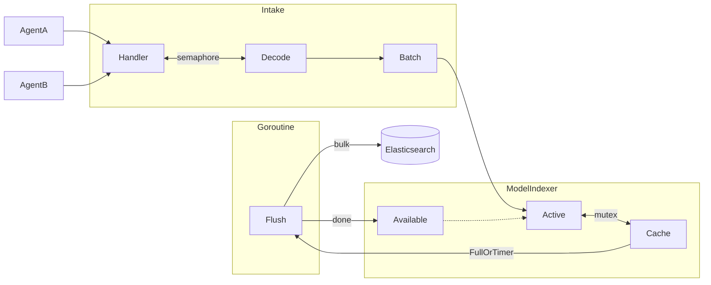
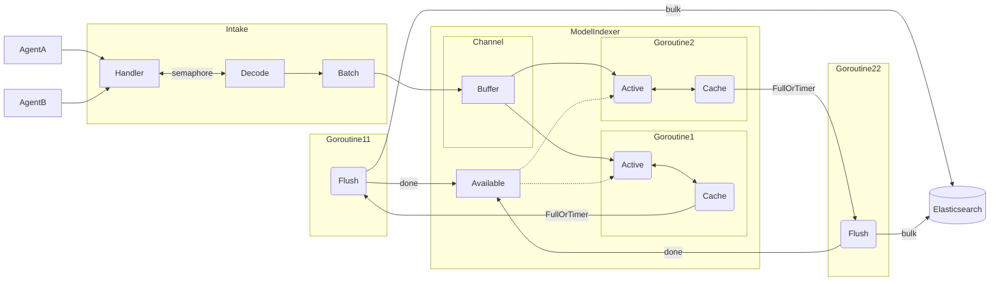

# Architecture of the APM Server

This document gives a high level overview over the architecture of the main APM Server components.
The main purpose of the APM Server is to ingest data. It validates, enriches and transforms data,
received from a variety of APM agents, into a dedicated format and passes them on to an output,
such as Elasticsearch.

## Ingest Flow

High level overview over incoming data and their flow through the APM Server until being passed on
to the output publisher pipeline.

## Modelindexer Architecture

When APM Server uses a custom Elasticsearch output called `modelindexer`. It fills a local cache until it
is full, and then, flushes the cache in the background and continues processing events.

From  `8.0` until `8.5`, the _modelindexer_ processed the events synchronously and used mutexes for
synchronized writes to the cache. This worked well, but didn't seem to scale well on bigger instances with
more CPUs.

From `8.6.0` onwards, the _modelindexer_ accepts events asynchronously and runs one or more _active indexers_,
which pull events from a local queue and (by default) compress them and write them to the local cache. This approach
has reduced locking, and the number of active indexers is automatically scaled up and down based on how full the
outgoing flushes are, with a hard limit on the number of indexers depending on the hardware.

