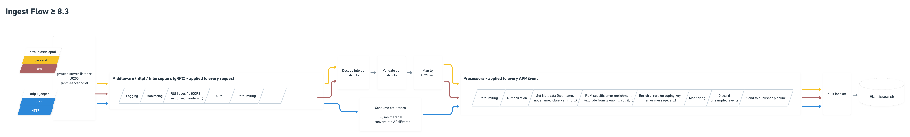

# Architecture of the APM Server

This document gives a high level overview over the architecture of the main APM Server components.
The main purpose of the APM Server is to ingest data. It validates, enriches and transforms data,
received from a variety of APM agents, into a dedicated format and passes them on to an output,
such as Elasticsearch.

## Ingest Flow

High level overview over incoming data and their flow through the APM Server until being passed on
to the output publisher pipeline.

When configured to output to Elasticsearch, APM Server uses a custom Elasticsearch output called
[`go-docappender`](https://github.com/elastic/go-docappender) (formerly known as `modelindexer`).
