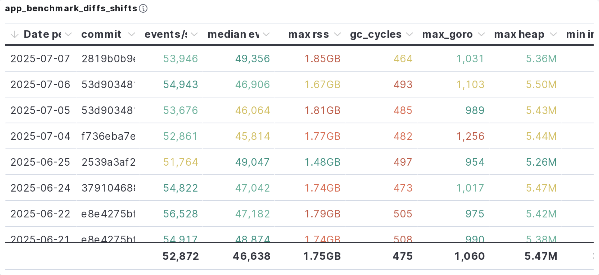

# APM Server Daily Benchmark

The daily benchmark for APM Server is run via [`benchmarks.yml` workflow](https://github.com/elastic/apm-server/actions/workflows/benchmarks.yml).
The benchmark creates an EC deployment and runs [`apmbench`](../systemtest/cmd/apmbench) to send pre-recorded events to the APM Server deployment.
Once all benchmark runs have been completed, the daily benchmark results and metrics are pushed to the observability cluster using Elastic's [`gobench`](https://github.com/elastic/gobench).
The results are then posted on Slack, and looks something like this:

## Benchmark Settings

Although the daily benchmark run with default settings, there are multiple different settings that can be configured when running the benchmark manually.

| Setting | Notes                                                                                                                                               |
|---------|-----------------------------------------------------------------------------------------------------------------------------------------------------|
| Benchmark against standalone APM Server with Moxy | Deploy APM Server with a minimal proxy for benchmark i.e. no ES                                                                                     |
| Enable tail-based sampling on APM server | Enable [TBS](https://www.elastic.co/docs/solutions/observability/apm/transaction-sampling#apm-tail-based-sampling)                                  |
| Storage size limit of tail-based sampling on APM server | See [Storage limit for TBS](https://www.elastic.co/docs/solutions/observability/apm/tail-based-sampling#sampling-tail-storage_limit-ref)            |
| Blanket sample rate used by tail-based sampling | See [Quantile of events sampled for TBS](https://www.elastic.co/docs/solutions/observability/apm/tail-based-sampling#sampling-tail-sample-rate-ref) |
| System profile for benchmark | All system profiles available can be found in [system-profiles](../testing/benchmark/system-profiles)                                               |
| Benchmark on latest stable version instead of a build from commit | Use latest stable APM Server version instead of building from branch commit                                                                         |
| Number of benchmark agents sending data to APM Server | See [benchtest](https://github.com/elastic/apm-server/blob/main/systemtest/benchtest/main.go#L229) for how agents count are used                    |
| Benchmark scenarios that only match regex | The [regex](https://github.com/elastic/apm-server/blob/main/systemtest/benchtest/main.go#L189) is similar to Go test run regex                      |
| Benchmark warmup time for APM Server | Warmup by sending events to APM Server before the actual benchmarking starts                                                                        |
| Benchmark with PGO export | Go [Profile Guided Optimization](https://go.dev/doc/pgo) using CPU profile from benchmark                                                           |

## Metrics

The metrics for the benchmark are collected by the [`expvar`](../systemtest/benchtest/expvar) collector.
The collector periodically queries the server's [`/debug/vars` endpoint](https://pkg.go.dev/expvar) and aggregates the metrics.
There are many metrics that are collected, but for the daily benchmark, only a few important ones are shown on the dashboard.

### events/s

This metric refers to the median count of events processed by APM Server over the total duration of the benchmark run.
The active events count is reported by Metricbeat as [`libbeat.output.events.active`](https://www.elastic.co/docs/reference/beats/metricbeat/exported-fields-beat), which is collected periodically by the collector and summed up.

If this metric decreases by a significant margin, it means the new APM Server has a performance regression, and we should investigate why.
Some possible reasons could be addition of new feature or performance regression in Elasticsearch affecting APM Server throughput.

### max rss

This metric refers to the maximum resident set size (RSS), which is the maximum amount of memory the APM Server process is using throughout the benchmark.
The metric is taken from [`beat.memstats.rss`](https://www.elastic.co/docs/reference/beats/metricbeat/exported-fields-beat), reported by Metricbeat.

If this metric increases by a significant margin, it means that new code additions in APM Server is causing higher memory usage.
If that is unexpected, we should investigate and fix it.
Note that benchmarks with lower throughput may also show lower RSS since APM Server could have been underutilized.

### gc cycles

This metric represents the number of garbage collection (GC) cycles that has been completed by the Go runtime.
The metric is taken from the Go [`runtime.Memstats` struct](https://pkg.go.dev/runtime#MemStats) - `NumGC`.

If this metric increases by a significant margin, it means that new code additions in APM Server is causing Go GC to run more frequently.
If this is unexpected, it should be investigated since this could be a result of memory leaks.

### max goroutines

This metric represents the maximum number of goroutines running at once during the benchmark.
The metric is reported by Metricbeat as [`beat.runtime.goroutines`](https://www.elastic.co/docs/reference/beats/metricbeat/exported-fields-beat).

If this metric increases by a significant margin, we should investigate it since it could potentially be a result of goroutine leaks.
Notably, a higher max goroutines count would contribute to higher max RSS as well.

### max heap obj

This metric refers to the maximum bytes of heap objects allocated by the Go runtime.
The metric is taken from the Go [`runtime.Memstats` struct](https://pkg.go.dev/runtime#MemStats) - `HeapAlloc`.

If this metric increases by a significant margin, we should investigate it since it could potentially be a result of memory leaks.

### min indexers

This metric represents the minimum mean number of bulk indexers available for making bulk index requests to Elasticsearch across the benchmark.
The metric is derived from  [`output.elasticsearch.bulk_requests.available`](https://www.elastic.co/docs/reference/beats/metricbeat/exported-fields-beat) in Metricbeat.
It is used to indicate the "busy-ness" of the [`go-docappender`](https://github.com/elastic/go-docappender) component in APM Server.

## Investigating Regressions

When there is a performance regression, first check when the regression started.
Then, look into the commits between the previous good run and the current run.
Usually, there aren't many commits in-between so finding the offending commit is relatively easy.
But in case it's not, checkout each commit into new branch, run the benchmark on the branch and check the results.
